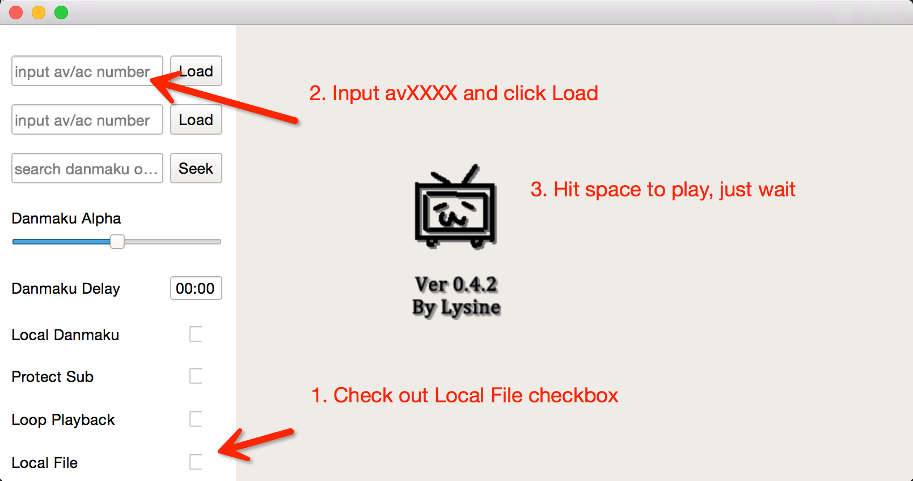

BiliLocal-OSX
=========
OSX build of [BiliLocal](https://github.com/AncientLysine/BiliLocal)

Features
--------
1. Fix some problems

2. Plugins for this OSX build
   - BiliAPI: api plugins. Fetch danmaku (and media url) via bilibili api
   - StayAwakePoi: Prevent screen from falling asleep while video is playing.

3. [Under Developing] Play online BiliBili video 
   - Bugs exists.
   - Can not fetch url of copyrights video

TO-DO
----
1. Fix Bugs

2. Add mpv as a backend player (I think I am too lazy and don't have time to work on it. It is just a dream)

Screenshots
----------

